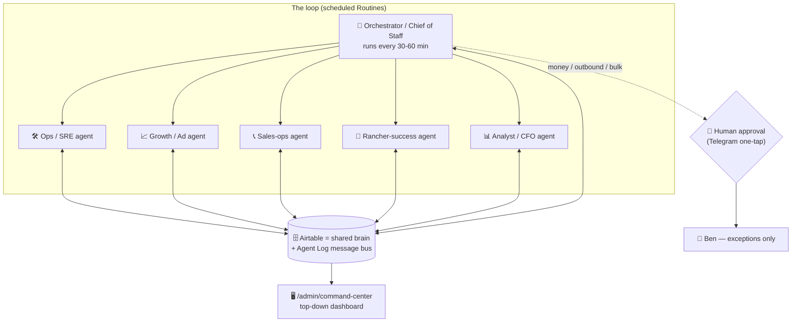

# BHC AI Ops Team — Autopilot Blueprint

_Goal: replace the things Ben does by hand with a team of scheduled AI agents that run BHC on a closed loop, talk to each other through shared state, escalate only the decisions that need a human, and report everything to one top-down dashboard — all inside the Claude Code / Agent SDK harness._

_Last updated 2026-06-12. Research grounded in the Claude Agent SDK + Routines docs and current multi-agent orchestration literature (sources at bottom). Two of four research queries hit the daily search cap; those sections lean on the retrieved Agent-SDK material + first principles + BHC's existing guardrails, and are marked._

---

## 0. The core realization

You already own ~90% of the infrastructure. "Hiring an AI team" is not a rebuild — it's standing up **scheduled agents on top of what's already wired:**

- **The runtime** — Claude Code / Agent SDK: subagents (delegated children with their own context, run in parallel), **Routines** (an agent that runs on a schedule, on a webhook, or on a git event), background agents, and built-in **human-in-the-loop checkpoints**.
- **The shared brain** — your Airtable base. Every table (Consumers, Referrals, Ranchers, Payments, Cron Runs) is already the company's memory. Agents read and write the same tables → that *is* how they coordinate.
- **The tool layer** — MCP servers already connected: Airtable, Stripe, Telegram, Resend, Vercel, web search. Every agent gets the same tools, so any agent can do any job.
- **The human channel** — the Telegram bot. Already how you get alerts + tap one-button decisions.
- **The product** — 33 crons, the webhooks, the desk. The deterministic automation is done; agents sit *above* it for judgment.

So the build is: an **orchestrator**, a handful of **worker agents** (your "employees"), a **message-bus table**, a **command-center dashboard**, and **approval gates** on anything that spends money or talks to a human.

---

## 1. Architecture — one picture

**Pattern used:** hierarchical orchestrator-worker (the Agent SDK default planner-worker), with a **blackboard** for coordination — agents don't call each other directly; they post and pick up work from a shared Airtable table. This is the most robust pattern for a solo operator: no agent can wedge another, everything is auditable, and you can kill any worker without breaking the rest.

---

## 2. Your manual jobs → AI employees

| Role (Routine) | Replaces you doing… | Cadence | Autonomy tier |
|---|---|---|---|
| **🧠 Orchestrator** | Deciding what needs attention next | every 30–60 min | reads everything, dispatches, escalates — never acts on money itself |
| **🛠 Ops / SRE** | Watching crons, errors, data integrity, the synthetic E2E | hourly | auto-fix reversible (re-run cron, resync Connect); escalate the rest |
| **📊 Analyst / CFO** | Compiling the daily numbers, P&L, funnel, cohorts | daily 8a | full auto (read-only) → feeds dashboard + digest |
| **📞 Sales-ops** | Pre-call brief, post-call follow-up, drafting the deposit invoice | event (call booked / completed) | drafts everything; **you approve the invoice send** |
| **🤝 Rancher-success** | Migration outreach, answering rancher questions, onboarding nudges | daily + on inbound reply | drafts replies + nudges; **you approve sends to real ranchers** |
| **📈 Growth / Ad** | Reading CAC/CPL/conversion, suggesting budget moves, drafting creative | daily | analyzes + drafts; **you approve any spend change** |
| **🛡 Lead-gen / SDR** | Spotting hot leads, drafting first-touch | continuous (already mostly automated by quiz+matching) | flags + drafts; auto-routes only what the matching gates already allow |

**The honest line on "the close":** the one thing not to fully hand off yet is *closing on the live call*. That's your edge and the highest-stakes moment. The agent's job is to make the call effortless — perfect brief in, instant invoice draft out — so you spend 15 minutes closing and zero minutes on everything around it. Autopilot for the 95%; you keep the trigger on the sale.

---

## 3. How the agents talk to each other (the message bus)

Don't wire agents to call each other directly — that's brittle. Use a **blackboard**: one new Airtable table, `Agent Tasks` (or `Ops Queue`), that is both the message bus and the audit trail.

**Suggested `Agent Tasks` schema:**
- `Type` (singleSelect: hot_lead_followup · call_done_no_invoice · rancher_stuck · cron_failed · budget_alert · data_drift …)
- `Status` (queued · in_progress · awaiting_approval · done · dismissed)
- `Priority` (P0–P3) · `Created By` (which agent) · `Assigned To` (which agent / human)
- `Subject Type` + `Subject Id` (e.g. Referral / recXXX) · `Payload` (JSON) · `Proposed Action` (the draft)
- `Decision` + `Decided By` + `Decided At` (the approval record)

**Flow:** Orchestrator scans the business → writes tasks. Workers claim tasks (`Status=in_progress`), do the work, either complete (`done`) or park for you (`awaiting_approval` + the draft in `Proposed Action`). You approve from Telegram or the dashboard → worker executes → logs `done`. Every action is a row = perfect audit + the dashboard's data source.

This is the same idea the literature calls the decentralized/pub-sub pattern, implemented on infra you already run, with zero new services.

---

## 4. Top-down dashboard — `/admin/command-center`

One pane of glass, fed by `Agent Tasks` + `Cron Runs` + the desk metrics:

- **Agent roster** — each agent, last run, last outcome, green/red.
- **Decision inbox** — every `awaiting_approval` task with its draft + one-tap Approve / Edit / Dismiss (mirrors Telegram).
- **The money loop** — pipeline $, today's closes, CAC vs commission, deposits outstanding (reuse the desk's now-correct tiles).
- **Funnel** — signup → quiz → match → call → deposit → close conversion (the panel you just un-zeroed).
- **Kill switches** — MATCHING_ENABLED, EMAIL_SEQUENCES_ENABLED, each agent's on/off, a global pause. One screen to slam the brakes.

---

## 5. Guardrails — non-negotiable _(grounded in Agent SDK human-in-the-loop checkpoints + BHC's existing gates; the dedicated guardrails search hit the cap)_

Tiered autonomy. The agent's authority scales with reversibility:

| Tier | Examples | Authority |
|---|---|---|
| **Read / analyze** | metrics, triage, drafts, briefs | full auto |
| **Reversible write** | re-run a cron, resync Connect, stamp a status, queue a task | auto + audit log |
| **Outbound / money / bulk** | send email to a real rancher/buyer, fire a deposit invoice, change ad spend, any bulk mutation | **human approval required** (one-tap) |

- Hard rules already in place that the agents inherit: `bhc-mutation-guardrails` (no bulk writes without per-record gates + side-effect inventory), the NRD refund block, the origin/CSRF money-path guards, kill-switch envs, the audit log on every mutation.
- Money movement (deposits, refunds, payouts) and ad spend get **hard dollar caps** + mandatory approval, full stop.
- Every agent action writes an `Agent Tasks` / audit row — nothing happens invisibly.

---

## 6. The token-economics reality _(important, from the Agent SDK metering docs)_

A 24/7 fleet costs real tokens. As of **June 15 2026**, headless Agent-SDK / scheduled usage draws from a **separate monthly Agent SDK credit pool** on subscription plans; heavy long-running jobs hit limits and need API-credit top-ups. Design for it:

- **Scheduled bursts, not always-on.** Orchestrator every 30–60 min beats a continuous loop.
- **Cheap model for monitoring, expensive model for judgment.** Ops/Analyst polling = Haiku-class; the orchestrator's decisions + sales/rancher drafting = Opus/Sonnet-class.
- **Let the deterministic crons do the grunt work** — agents only engage where judgment is needed, not to do what a `filterByFormula` already does.
- Budget a monthly token line the way you'd budget a salary. One competent AI ops fleet ≈ the cost of the part-time ops hire you're replacing — but it never sleeps.

---

## 7. Execution — crawl, walk, run

**Phase 1 — prove the loop (safe, read-only):**
1. Create the `Agent Tasks` table.
2. Stand up the **Orchestrator** + **Ops/SRE** + **Analyst** Routines (read + triage + draft only — zero outbound).
3. Build `/admin/command-center` reading `Agent Tasks` + `Cron Runs`.
→ Outcome: you watch the agents narrate + triage the whole business for a week, approving nothing risky. Confidence built.

**Phase 2 — close the loop on the safe-but-valuable actions:**
4. **Sales-ops** agent: on `Sales Call Completed At`, auto-draft the deposit invoice → `awaiting_approval`; you tap Approve → it fires. Post-call follow-up drafts.
5. **Rancher-success** agent: drafts migration outreach + inbound-reply responses → your approval.

**Phase 3 — tighten to exceptions-only:**
6. **Growth/Ad** agent + auto-approval *rules* for the categories that proved safe over Phase 2 (e.g. "follow-up emails to buyers under the existing frequency cap → auto"; money + spend stay manual).
7. The loop now runs itself; you touch the Decision Inbox a few times a day and close calls.

---

## Sources
- [Claude Agent SDK in 2026 — Totalum](https://www.totalum.app/blog/claude-agent-sdk-totalum-2026)
- [Building Agents with Claude: Skills, Scheduled Tasks, Routines — Hatchworks](https://hatchworks.com/blog/claude/building-agents-with-claude/)
- [Claude Code Agents & Subagents (2026) — CloudZero](https://www.cloudzero.com/blog/claude-code-agents/)
- [Agent SDK overview — Claude Code Docs](https://code.claude.com/docs/en/agent-sdk/overview)
- [Subagents in the SDK — Claude API Docs](https://platform.claude.com/docs/en/agent-sdk/subagents)
- [Multi-Agent Orchestration Guide 2026 — Codebridge](https://www.codebridge.tech/articles/mastering-multi-agent-orchestration-coordination-is-the-new-scale-frontier)
- [AI Agent Orchestrator 2026: Frameworks & Patterns — Totalum](https://www.totalum.app/blog/ai-agent-orchestrator-totalum-2026)
- [What is AI Agent Orchestration? — IBM](https://www.ibm.com/think/topics/ai-agent-orchestration)
