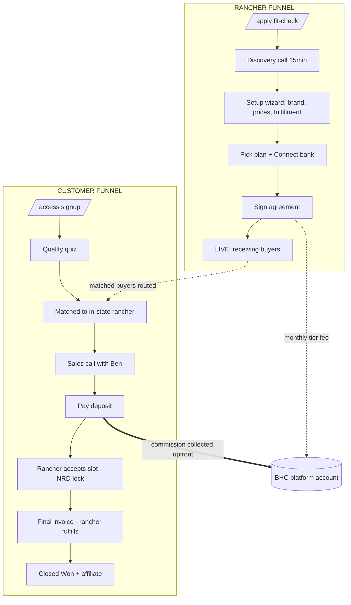
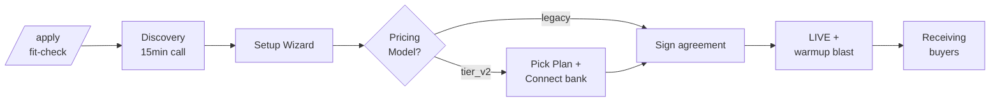
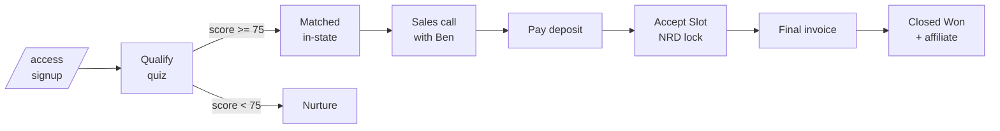

# BHC Platform Map — Top-Down Source of Truth

_Last updated: 2026-06-22 (cockpit launch note appended below; core map current to 2026-06-15). Accurate to current production code. This is the single
crystal-clear picture of the whole machine: service offerings, the money model, the
rancher onboarding funnel, the customer funnel, and every tool that executes. Where an
older doc disagrees, this one wins. Drift between code and comments is flagged in §6._

> **2026-06-15 launch note.** tier_v2 is **LIVE** and the legacy→tier_v2 migration has
> **launched** (14 active legacy ranchers invited via Bulk Invite, 41 dormant reactivated).
> A 16-fix hardening pass shipped the same day (Connect-active routing gate, hot-path buyer
> session, resend-link token, `/contact` page, cut-specific deposit idempotency, self-serve
> wizard Step 4, deposit-input UI, admin `getRecordById` fixes, Cal webhook onboarding
> tie-back, capacity-drift Slot Locked, migration-status guards on 3 crons, rancher-followup
> live Cal link, Telegram HTML-escaping, Connect-stuck monitoring). For the marketing-funnel +
> paths-to-money view, see [`MONEY-FUNNELS.md`](MONEY-FUNNELS.md).
>
> **2026-06-22 update — launch product shipped.** The rancher dashboard is now the **business cockpit** (PR #88, merged + live): a Home triage tab (tap-to-act action cards + "you've been paid $X · next payout" money strip) + a 5-item nav spine (Home·Deals·My Page·Messages·Money). Pricing collapsed to **one editor** — `lib/pricing.ts` one-input whole-price → half/quarter + 25% deposit (replaced 3 non-reconciling editors). Onboarding is now **close-first**: the setup wizard gates on the discovery/onboarding call BEFORE setup (`canSkipBooking()` spares already-onboarded migrators). PR #89 then removed residual cruft (11 native popups → branded inline notices, a "coming soon" placeholder, hardcoded operator Cal-link/gmail). Migrators get all of this via the same `/rancher` + `/rancher/setup` surfaces. The **Connect webhook is now registered** (`STRIPE_CONNECT_WEBHOOK_SECRET` live, 7 events) — but **no deposit has settled end-to-end yet**; the gate before ad spend is ONE real-card smoke deposit through Renick. The **full commerce platform (catalog/cart/inventory on Supabase) is built but PARKED** (`commerce-platform-phase-0`) — pilot-behind-a-flag later, NOT the launch. (§1 dashboard + §3 rancher funnel reflect this; the cow-share deposit money model in §2 is unchanged.)

---

## 0. The Machine in One Picture

Two funnels feed one money engine. Ranchers come in on the left, customers on the right,
and they meet at the **deposit** — which is where BHC's commission is collected, upfront.



**The core insight:** BHC's commission is taken **at deposit time, on the full sale price**,
via Stripe Connect `application_fee_amount`. The rancher's final invoice carries **zero** BHC
fee. So one buyer = one commission event, collected the moment they commit.

---

## 1. What BHC Is + Service Offerings

BHC is a marketplace that brings qualified, in-state beef buyers to verified D2C ranchers,
handles the qualification sales call and the deposit, and lets the rancher do what they do
best: raise and fulfill the beef. **"We bring the buyers to your state — you close them."**

### 1.1 Rancher plans (`lib/tiers.ts`)

| Tier | Monthly | Commission | One-line promise |
|---|---|---|---|
| **Pasture** | $150/mo | **7%** | "We send you buyers." |
| **Ranch** | $350/mo | **3%** | "We send you buyers AND make sure they see you first." |
| **Operator** | $500/mo | **0%** | "We send you buyers, position you, and run your marketing." |
| **Legacy Connect** | $0/mo | **10%** | On-platform deposits, no subscription. Operator-assigned hybrid. |

- Monthly fee is auto-deducted from the rancher's **Stripe Connect balance** (no card on file).
- Default commission for a rancher with no tier set = **10%**.
- **Legacy Connect** is the migration on-ramp: a legacy rancher keeps 10% but upgrades deposit
  collection to on-platform Stripe Connect. Set via `/api/admin/ranchers/[id]/mark-legacy-connect`,
  or self-serve from wizard "Pick Your Plan."

**À-la-carte add-ons** (any tier): on-site video $2,500 · annual photo refresh $1,500 ·
founder-letter campaign $750 · brand-partner intro 15% of closed deal · PPC management 15% of
ad spend ($500/mo min).

### 1.2 The tier_v2 deposit money model (`lib/stripeConnect.ts`)

The buyer pays a **direct charge on the rancher's own Connect account**. The split:

```
feeRate          = TIERS[tier].commissionRate         # 0.07 / 0.03 / 0 / 0.10
platformFee      = round(fullSalePrice × feeRate)      # BHC commission, on the FULL sale
totalCharged     = deposit + platformFee               # buyer pays deposit + full fee on top
fulfillmentBalance = fullSalePrice − deposit           # rancher collects later, off the final invoice
```

- Rancher nets their full **deposit** immediately; BHC's `platformFee` sweeps from the rancher's
  Connect balance to the BHC platform account.
- Buyer's receipt shows two line items: the deposit + a **"BuyHalfCow service fee"**.
- **Final invoice** (`createFinalInvoiceCheckout`) has `application_fee = 0` — 100% to the rancher.

**Worked example — $2,000 half cow at 10%:**
deposit $1,200 → $1,000 rancher + **$200 BHC** · final $800 → $800 rancher + **$0 BHC** ·
totals: rancher $1,800, BHC $200 (= exactly 10% of $2,000).

### 1.3 NRD — Non-Refundable Deposit policy (`NRD-2026-06-05`)

- Deposit is **refundable** until the rancher taps **Accept Slot**
  (`POST /api/rancher/referrals/[id]/accept`) → stamps `Rancher Accepted At`, flips referral to
  `Slot Locked`, emails the buyer "your deposit is now non-refundable."
- The refund endpoint (`/api/admin/payments/refund`) **hard-blocks (HTTP 412)** once
  `Rancher Accepted At` is set, unless an operator passes `nrdOverride=true` + a reason (fires a
  loud Telegram). Refunds run on the connected account with `reverse_transfer` +
  `refund_application_fee` so BHC's commission is clawed back correctly.

### 1.4 Division of labor

| BHC handles | Rancher handles |
|---|---|
| Buyer traffic (ads, SEO, /map, landing pages) | Raising / sourcing the beef |
| Qualification quiz + **the sales call (Ben)** | Closing the buyer on the call's terms |
| Matching in-state qualified buyers | Setting aside cuts + processing slot |
| Deposit collection + commission (upfront) | **Final invoice** for the balance (100% theirs) |
| NRD enforcement + refund mediation | Processing, pickup/delivery, fulfillment confirm |
| Marketing surfaces, intros, reply tracking | Their own bank, payouts, tax forms (full Stripe dashboard) |

### 1.5 Other revenue engines

- **Founders / Founding Herd** (`/founders`): Founding 100 = $1,000 one-time × 100 spots
  (early-bird flips to $1,500); Title Founder = $15,000 × 10 spots; recurring backer tiers
  Steward $75/mo, Outlaw $25/mo, Herd $9/mo.
- **Brand-partner listings** — the live `/brand-partners` subscription tiers: Spotlight $99/mo,
  Featured $499/mo, Founding $1,500–$2,500/3mo (Stripe Price IDs in env, `STRIPE_BRAND_PRICE_*`,
  via `GET /api/checkout/brand`). The old $299 one-time listing constant + flow was removed
  2026-06-12 (see §6) — it was a separate dead product, not a duplicate price.
- **Marketing retainers** = the Operator tier + add-ons (no separate SKU).
- **Merch** — Shopify-hosted (prices not in this repo).
- **Funnel upsells (feature-flagged OFF):** $49 Reservation Hold, $497 White Glove Onboarding.

---

## 2. Rancher Onboarding Funnel



| Stage | What happens | Tool / endpoint | Key Airtable writes |
|---|---|---|---|
| **Apply** | Public fit-check (volume, constraint, deposit-capable). Auto-qualifies, mints 60-day setup JWT | `app/apply` → `POST /api/apply` | `Status=Pending`, `Pricing Model=tier_v2`, `Operation Details` |
| **Discovery call** | Optional 15-min Cal.com call before the wizard (`/15min`) | `app/api/webhooks/cal` | `Onboarding Status=Call Scheduled/Complete` |
| **Setup wizard** | Contact + **Cal.com slug** → Brand → **Prices + Processing Fees + Deposits** → book onboarding call → (tier_v2: Pick Plan → Connect bank) → Fulfillment + **Refund Policy** → Sign | `app/rancher/setup/RancherSetupWizard.tsx` → `/api/rancher/setup` | `{Tier} Price/Processing Fee/Deposit`, `Cal.com Slug`, `Fulfillment Types`, `Refund Policy` |
| **Pick plan** | Pasture/Ranch/Operator (Stripe subscription Checkout) or Legacy Connect (inline) | `/api/rancher/tier/select` | `Tier`, `Pricing Model=tier_v2`, `Stripe Connect Status=onboarding` |
| **Connect bank** | Stripe Express onboarding; fresh account-link every call (expiry auto-recovery) | `/api/rancher/connect/start` | `Stripe Connect Account Id`, `Stripe Connect Status=onboarding` |
| **Connect active** | `account.updated` webhook → **live Stripe read** → flips status; auto-flips Pricing Model→tier_v2 + Migration=completed | `/api/webhooks/stripe-connect` → `syncRancherConnectStatus` | `Stripe Connect Status=active`, `Stripe Connect Connected At` |
| **Sign agreement** | Locks commission rate; if content-complete, **auto-goes-live** | `/api/ranchers/sign-agreement` | `Agreement Signed`, `Commission Rate` (locked), → `Active`/`Live` |
| **Go live** | 8 paths converge on the same tuple; most fire a waitlist warmup blast | sign-agreement / admin go-live / Telegram / batch-approve cron | `Page Live=true`, `Active Status=Active`, `Onboarding Status=Live` |

**Legacy-rancher migration (LAUNCHED 2026-06-15 — 14 active legacy invited via Bulk Invite, 41 dormant reactivated):**
`/admin/migration` tracker → `send-v2-upgrade` (60-day JWT + 14-day deadline) →
`migration-deadline` cron (nudges at **7/4/2/1 days left**, auto-pause at Day 14) →
**🔄 Resync** button (`/api/admin/ranchers/[id]/resync-connect`) force-reads Stripe when a
Connect status is stuck. Migration self-completes the moment Connect goes active on a paying tier.
Ranchers can self-serve the `/rancher/setup` wizard end-to-end (tier pick incl Legacy Connect →
Connect bank → per-cut Price/Deposit/Fee → sign → go live) **or** book the "Rancher Onboarding" call.

> **The single gate that turns deposits on:** the buyer deposit checkout
> (`/api/checkout/deposit`) hard-requires `Stripe Connect Status='active'`. Only the
> `account.updated` webhook (or the Resync button) writes that. If a rancher "finished Stripe"
> but can't take deposits, check that field first.

---

## 3. Customer Funnel

Two lifecycle fields run in parallel: **Buyer Stage** on Consumers
(`NEW → WAITING/READY → MATCHED → CLOSED`) and **Referral Status** on Referrals
(`Pending Approval → Intro Sent → … → Awaiting Payment → Slot Locked → Closed Won/Lost`).



| Stage | What happens | Tool / endpoint | Stage transition |
|---|---|---|---|
| **Signup** | 5-field form, phone required, server-side intent score. In-state Beef Buyers redirect straight to the quiz | `app/access` → `POST /api/consumers` | `Buyer Stage=NEW→READY/WAITING`; Meta **Lead** |
| **Qualify quiz** | 4-question gamified quiz, scored 0–100. **Threshold 75.** Writes Qualified At **first** (matching reads it) then routes | `app/qualify/[id]` → `POST /api/qualify` | `Qualified At`, `Qualification Score`; → matching |
| **Warmup** (waitlist path) | When a rancher goes live in a waiting buyer's state, re-engage; YES click → quiz | `rancher-launch-warmup` cron + `/api/warmup/engage` | `Warmup Sent/Engaged At`, `Ready to Buy=true` |
| **Matching** | Gates: qualified (412 if not), state-local only, capacity, tier/price fit, operational. Sorts, creates referral, auto-approves, fires intros | `POST /api/matching/suggest` | `Buyer Stage=MATCHED`, `Referral Status=Intro Sent` |
| **Intros** | Rancher intro (quiz block + quick-action buttons). Buyer intro suppressed for tier_v2 (they get the Cal invite instead) | inside matching/suggest | — |
| **Sales call** | Buyer books Ben's Cal; pre-call brief to Ben; **1-hour reminder** fires off the real start time | `/api/webhooks/cal` + `cal-reminder-1h` cron | `Sales Call Booked/Start/Completed At` |
| **Deposit** | Ben sends deposit invoice → buyer pays (gated on Connect `active`) → webhook stamps paid | `send-deposit-invoice` → `/api/checkout/deposit` → `/api/webhooks/stripe` | `Referral Status=Awaiting Payment`, `Deposit Paid At` |
| **Accept Slot** | Rancher locks the slot → **deposit non-refundable** | `/api/rancher/referrals/[id]/accept` | `Referral Status=Slot Locked`, `Rancher Accepted At` |
| **Final invoice** | Rancher sends balance invoice (app_fee=0) | `/api/rancher/referrals/[id]/send-final-invoice` | `Final Invoice Sent At`, balance |
| **Closed Won** | Buyer pays balance → close → capacity decrement → **affiliate auto-enroll** | `/api/webhooks/stripe` (final_invoice) → `recordClose` | `Referral Status=Closed Won`, `Buyer Stage=CLOSED`, `Affiliate Code` |

**Mid-funnel nudges (all stage-gated so they never hound someone who advanced):**
`abandoned-quiz-nudge` (signed up, never finished quiz) · `qualified-no-action` (qualified,
no action) · `buyer-pulse` (intro sent 5+ days, "did your rancher reach out?").

---

## 4. Tool Execution Inventory

### 4.1 Crons (33, from `vercel.json`; all times MT = UTC−6)

| Cron | MT | Purpose | Status |
|---|---|---|---|
| `deploy-drift` | :00/:30 | Alert if prod SHA ≠ GitHub HEAD | active |
| `cal-reminder-1h` | every 10m | 1-hour sales-call reminder (windows on real start time) | active |
| `qualified-no-action` | every 30m | Abandon-cart nudge for qualified buyers | gated on `MATCHING_ENABLED` |
| `synthetic-e2e` | 12:00a | Synthetic signup→quiz→match smoke test | active |
| `reclassify-buyers` | 10:00p | Recompute every buyer's Routing Segment | active |
| `nightly-rancher-audit` | 11:00p | Per-rancher pipeline audit → Telegram | active |
| `daily-audit` | 11:45p | AI morning audit sweep | active |
| `batch-approve` | 3:00a | Auto-approve qualified buyers + kick matching | gated on `MATCHING_ENABLED` |
| `compliance-reminders` | 3:15a | Monthly rancher report (1st only); honors opt-out | active |
| `capacity-drift-check` | 6:00a | Reconcile Redis ↔ Airtable capacity | active |
| `healthcheck` | 7:00a | Ping /api/health → Telegram | active |
| `rancher-launch-warmup` | 7:30a | Warm waitlisted buyers per live rancher | active |
| `daily-digest` | 8:00a | Morning ops + AI brief to Ben | active |
| `backer-monthly-letter` | 8:00a (1st) | Monthly founder letter to backers | active |
| `rancher-trust-promotion` | 8:45a | Flip Trust Mode at ≥5 closes | active |
| `stuck-buyer-recovery` | 8:30a | Retry matching for stuck READY buyers | active |
| `daily-health-digest` | 9:00a | 9am platform-health Telegram | active |
| `migration-deadline` | 9:00a | tier_v2 migration nudges + Day-14 auto-pause | active |
| `rancher-followup` | 9:00a | Stale-lead + prospect nudges (Mon) | active |
| `email-sequences` | 10:00a | Buyer drip engine | **DISABLED** (`EMAIL_SEQUENCES_ENABLED` off) |
| `commission-invoices` | 10:20a | Monthly commission invoices (1st; legacy ranchers only) | active |
| `re-warm-cohort` | 10:30a | Reset warmup on 60-day-cold buyers | active |
| `onboarding-stuck` | 10:15a | Day 3/7/14 nudge for stuck ranchers | active |
| `awaiting-payment-nudge` | 11:10a | Nudge ranchers stuck on Awaiting Payment | active (admin Telegram) |
| `referral-chasup` | 11:05a | AI re-engage (max 3) + auto-close stale | needs AI configured |
| `close-detector` | 11:15a | Telegram "did this close?" cards | active |
| `send-scheduled` | hourly | Dispatch scheduled campaigns | active |
| `abandoned-quiz-nudge` | hourly | Nudge buyers who never finished quiz | active |
| `buyer-pulse` | 12:00p | "Did your rancher reach out?" pulse | active |
| `testimonial-collection` | 12:15p | Ask Closed-Won buyers for testimonials | active |
| `orphan-checkout-reaper` | 12:30p | Reconcile pending Payments vs Stripe | rewarm gated off |
| `spam-audit` | Sat 8:00a | Weekly send-volume / cap audit | active |

Every cron logs to the **Cron Runs** Airtable table (`withCronRun`) and most respect
`MAINTENANCE_MODE`.

### 4.2 Webhooks (8)

| Webhook | Source | What it does |
|---|---|---|
| `/api/webhooks/stripe` | Stripe platform | Deposits, final-invoice close, subscriptions, brand/founder payments, disputes, refunds |
| `/api/webhooks/stripe-connect` | Stripe Connect | **Flips `Stripe Connect Status=active`** (the deposit gate); disputes/deauthorize on connected acct |
| `/api/webhooks/cal` | Cal.com | Stamps onboarding/migration/sales-call status; pre-call brief |
| `/api/webhooks/manychat` | ManyChat IG/DM | AI closer bot → Conversations + Consumers |
| `/api/webhooks/resend` | Resend | Bounce/complaint → suppress; open/click → telemetry |
| `/api/webhooks/resend-inbound` | Resend inbound | AI-classify replies → Conversations + one-tap close |
| `/api/webhooks/telegram` | Telegram bot | The operator console (commands + one-tap callbacks) |
| `/api/webhooks/twilio-recording` | Twilio | Call recording → Whisper transcript → Conversations |

### 4.3 Email (the system, `lib/email.ts` + `lib/emailFrequencyGuard.ts`)

~63 `send*` functions. Frequency cap = 3/week unless the template is in the
**TRANSACTIONAL_WHITELIST** (signup, approval, magic links, intros, commission/final invoices,
deposit/fulfillment confirmations, etc.). Key buyer-path emails: `sendWelcomeAndReadyToBuy`,
`sendBuyerIntroNotification`, `sendBuyerDepositInvoice`, `sendBuyerFinalInvoice`,
`sendAffiliateWelcome`. Key rancher-path: `sendRancherApplyAutoApproved`,
`sendRancherIntroNotification` (quick-action buttons), `sendInstantCommissionInvoice`,
`sendMagicLink`. **9 drip templates are dormant** because `email-sequences` is disabled.

### 4.4 Feature flags / kill switches

| Flag | Effect |
|---|---|
| `MATCHING_ENABLED=false` | Hard-stops matching/suggest + batch-approve + qualified-no-action |
| `MAINTENANCE_MODE=true` | Most crons early-return |
| `EMAIL_SEQUENCES_ENABLED` | Off → the buyer drip engine is dark |
| `ENABLE_SMS` + per-buyer `SMS Opt-In` | Gate every Twilio send |
| `STRIPE_CONNECT_ENABLED` | Off → the entire tier_v2 + Legacy-Connect track is dark |
| `ON_PLATFORM_MESSAGING_ENABLED=false` | Threads off; intros rely on email Reply-To |

---

## 5. The Money, End to End

```
BUYER ─ deposit + full BHC fee ─► RANCHER Connect acct (direct charge)
                                      ├─ keeps deposit
                                      └─ application_fee (7/3/0/10%) ─► BHC platform acct
BUYER ─ final balance ─────────► RANCHER (app_fee = 0)
RANCHER ─ monthly tier fee ────► BHC (auto-debit from Connect balance)

Standalone BHC revenue (no rancher):
  Founders $1,000×100 + $15,000×10 + backer subs ($9–$75/mo)
  Brand partners $99 / $499 /mo + $1,500–$2,500 founding
  Add-ons: video $2,500 · photo $1,500 · letter $750 · brand-intro 15% · PPC 15%
  Upsells (off): Reservation Hold $49 · White Glove $497
  Merch: Shopify
```

---

## 6. Known drift & flags (be honest about these)

1. **Brand-partner pricing — RESOLVED 2026-06-12.** The `$299` one-time listing was a separate dead
   product, not a duplicate price for the subscription tiers. Decommissioned: removed the
   `BRAND_LISTING_PRICE_*` constants (`lib/stripe.ts`), `POST /api/brands/checkout`, the
   `/brand/payment` + `/brand/payment/success` pages, the admin approval→payment-email branch,
   and `sendBrandApprovalWithPayment`. Live pricing = the `/brand-partners` subscription tiers
   ($99/$499/mo + $1,500–$2,500/3mo) via `GET /api/checkout/brand` (Stripe Price IDs in env).
   ⚠️ Inert leftover: the `brand-listing` case + `handleBrandListingCompleted` in the Stripe
   webhook are now unreachable (nothing emits `metadata.type='brand-listing'`) — safe to prune
   in a separate, webhook-focused pass.
2. **`email-sequences` is disabled** — the whole buyer nurture drip is off by design (sales-floor
   pivot). When you turn it on, the `classifyBuyer` fix (transacting buyers → no nurture) is what
   keeps it from emailing someone mid-deposit. Verify before flipping `EMAIL_SEQUENCES_ENABLED`.
3. **migration-deadline nudge days** = code fires at **7/4/2/1 days left** (some comments/tasks say
   7/10/12/13 — code is authoritative).
4. **Nationwide routing is disabled** — matching is state-local only; `Ships Nationwide` is not read.
5. **`abandoned-quiz-nudge`** links to `/qualify/<id>` without a fresh JWT — the page must reissue a
   token or the nudged buyer can't submit. Weakest link in re-engagement.
6. **Stale fields/typos:** `Max Active Referalls` (misspelled, intentional compat); `/apply` does
   not actually write `Onboarding Status='Lead'` despite a comment.
7. **`deploy-drift`** hardcodes `REPO_OWNER='benjibushes'` — confirm it matches the live GitHub org.

---

_Maintained alongside the code. When a funnel stage, price, cron, or flag changes, update this file._
